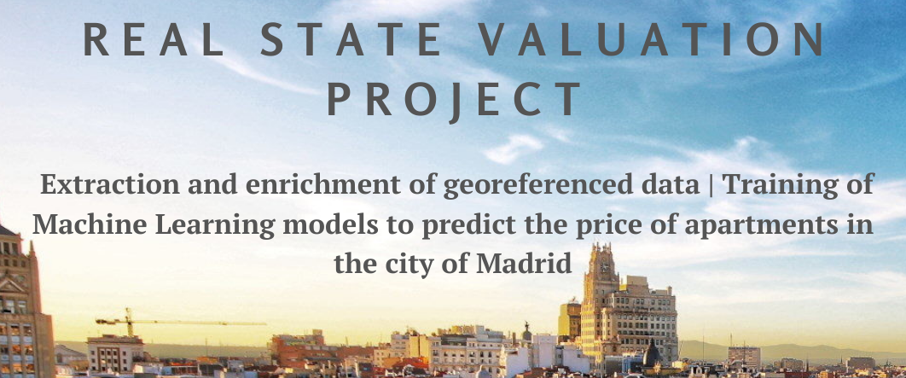
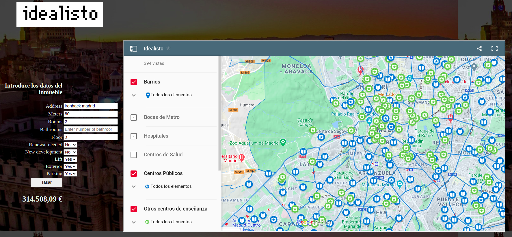

##### Project developed in Ironhack 08.20 Data Analytics bootcamp
## Objective

This project aims to be a property appraiser application for properties in the city of Madrid.

This app is accessible in the following link (please, be patient the first time while the server starts): [Idealisto Tasador](https://idealisto.ew.r.appspot.com/find)

This work has been executed as the final project of the Ironhack's Data Analytics Fulltime Bootcamp. Three main areas hace been covered: 
- Extraction, cleaning and enrichment of data through the use webscrapping, APIs or Pandas amongo others.
- Machine learning models training with Sklearn an H20.
- Deployment of a web application to find the valuation of apartments in Madrid with Python, HTML and CSS.

## Project development

1. Extraction of the properties data from Kaggle and Idealista.com.
2. Cleaning and treatment of the dataset. Geolocation of the properties in exact coordinates from the approximate available address. Classification by district zones.
3. Extraction of data related with safety, health, transport and education from the Madrid City Council website. Classification of the districts according to these categories. 
4. Training of the Machine Learning model. Different Python modules (Sklearn and H2O) and hyperparameters (Grid SearchCV) are tested. Finally the chosen model is ExtraTreesRegressor.
5. Creation of the app logic.
6. Deployment as a web app and creation of the map layers.

## Structure

- `main.py`: Executable script to run the server with the web app.
- `templates/`: Contains the HTML template for the app.
- `static/`: Contains images

- `src/`:
	1. `data_cleaning/`: Folder containing Jupyter Notebooks used for data cleaning.
	2. `machine_learning_train/`: Folder containing Jupyter Notebooks used for training the machine learning model.
	3. `get_address_neigh.py`: Script used in `main.py` to get geografic data
    
- `data/`:
    1. `inputs`: Properties data downloaded from Kaggle, Idealista and Madrid City Council website.
	2. `outputs`: Data used for cleaning, development and running of the app.

## Using the program

Enter the data of the property to be appraised in the box on the left. Press "Appraise" and wait for the result. 
Use the map on the left to filter the layers with the following information:

- Neighborhoods
- Metro Stations
- Hospitals
- Health Centers
- Educational Centers
- Police stations
- Fire stations

## Main sources and references
###### Data source
 - [Madrid real state market](https://www.kaggle.com/kerneler/starter-madrid-real-estate-market-e5958d05-4)
 - [Idealista.com](Idealista.com)
 - [Portal de datos abiertos del Ayuntamiento de Madrid](https://datos.madrid.es/portal/site/egob/)

###### Python libraries and programs
- `Python`
- `BeautifulSoup`
- `Numpy`
- `Pandas|Geopandas`
- `Matplotlib`
- `Seaborn`
- `Sklearn`
- `H20`
- `Gdal`
- `Shapely`
- `QGIS`
- `Google Maps APIs (GeoCoding and Embed Maps)`
- `Heroku`
- `flask`
- `HTML`

## Next steps
This project is not finished at all! Next steps should be:
- Improve accuracy of the model.
- Introduction of data in a SQL database.
- Argsparse to allow the update of the properties data.
- Automatization and improvement a of data collection methods (advanced web scrapping, thor, selenium...)
- Especifically for the web app:
    * Replace the interface for a cleaner one
    * Deployment of new endpoints to find the price by providing a link of Idealista or Fotocasa.
    * Connecting the map to the address requests 

